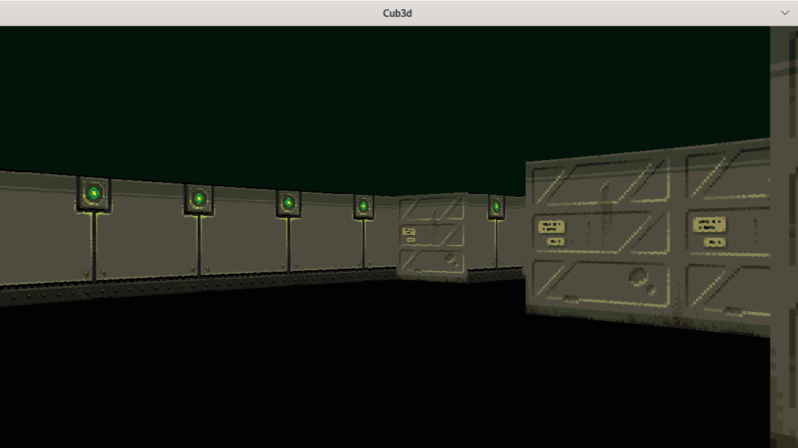
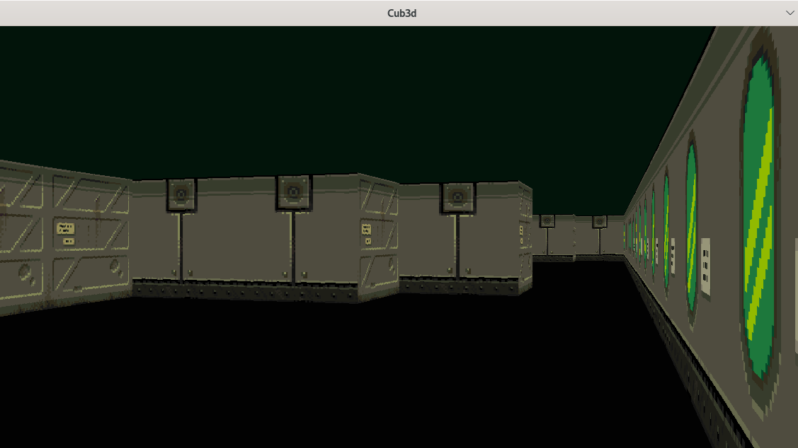

<h1>Cub3D</h1>
<h2>Presentation</h2>
<b>Cub3D</b> is a simple game engine based on <b>mlx</b> and coded in <b>C</b>.  It uses a <a href="https://en.wikipedia.org/wiki/Ray_casting#:~:text=The%20idea%20behind%20ray%20casting,eye%20sees%20through%20that%20pixel.">RayCasting</a> algorithm for rendering in <b>3D</b>.
<h1>Project Compilation</h1>
<b>⚠️ The project can only be compiled on Linux ⚠️</b>  
Launch the make command in a terminal:
<pre>make</pre>
<h1>Launch the executable</h1>
To launch the executable, you need to provide it with a .cub map file as a parameter.
<pre>./Cub3D Maps/map.cub</pre>
<h1>Maps</h1>
Here is an example configuration file for a map:
<pre>
NO Texture/no.xpm <- North Texture
WE Texture/we.xpm <- West Texture
EA Texture/ea.xpm <- East Texture
SO Texture/so.xpm <- South Texture
C 2,20,10 <- Ceiling color
F 2,2,2 <- Floor color

111111111111111111
110000000000000001
100000000000000001
100000000000000001
100000000000000001 <= The map
100000000000000001
10000N000000000001 <= The player represented by N/S/W/E
100000000000000001
111111111111111111
</pre>

<h1>Rendering</h1>
 

